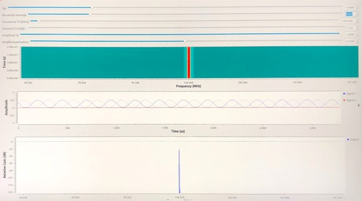
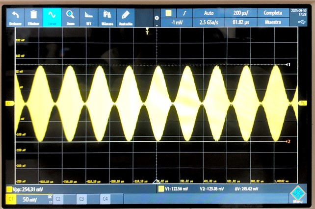
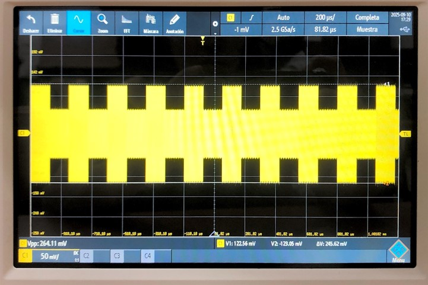
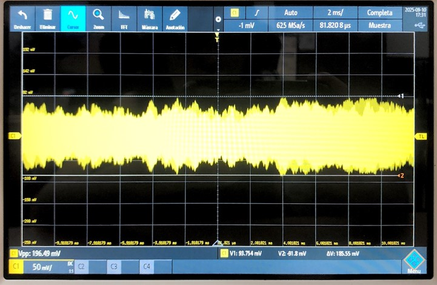
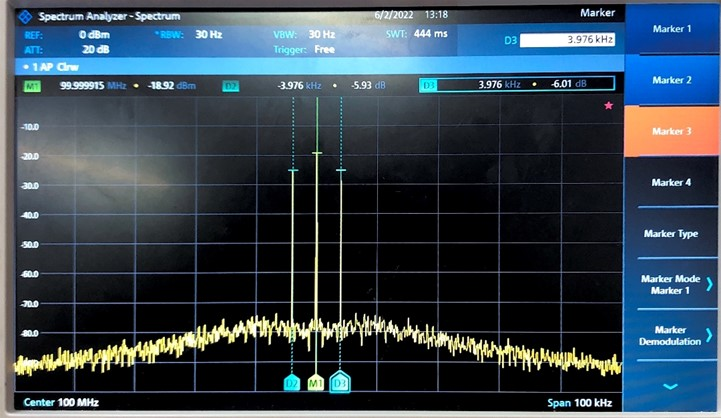
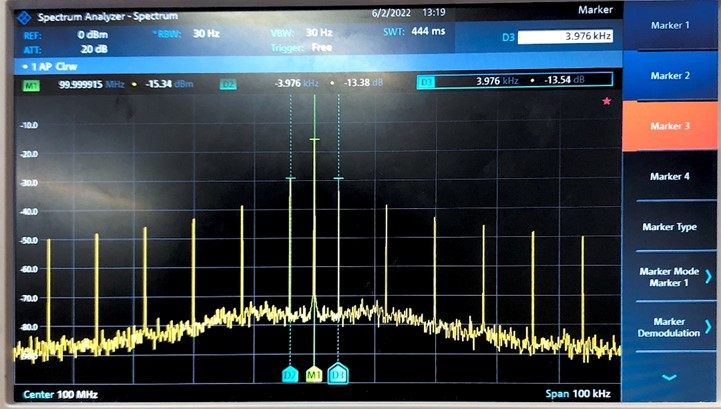
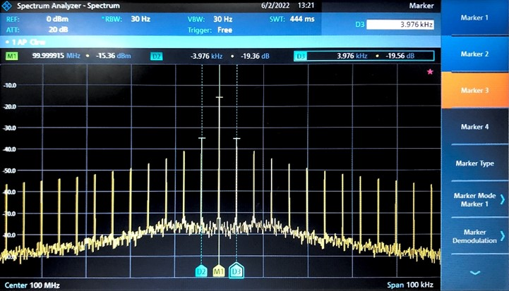
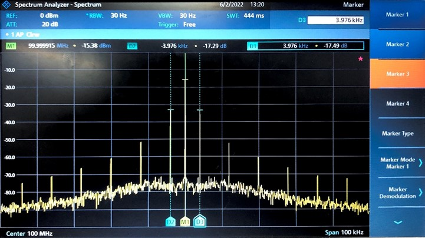
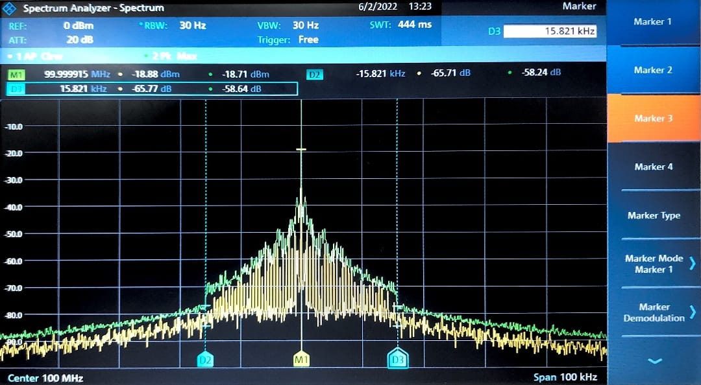

# Laboratorio de Comunicaciones
## Universidad Industrial de Santander

---
# Misión 3: Modulación de onda continua

### Integrantes
- **MICHELLE GARZÓN CAMPOS** - 2202785
- **JOHAN SEBASTIAN FANDIÑO** - 2204271

Escuela de Ingenierías Eléctrica, Electrónica y de Telecomunicaciones  
Universidad Industrial de Santander

---

## Declaración de Originalidad y Responsabilidad
Los autores de este informe certifican que el contenido aquí presentado es original y ha sido elaborado de manera independiente. Se han utilizado fuentes externas únicamente como referencia y han sido debidamente citadas.

Asimismo, los autores asumen plena responsabilidad por la información contenida en este documento. 

Uso de IA: Se utilizó ChatGPT para reformular secciones del texto y verificar gramática, pero el contenido técnico fue desarrollado íntegramente por los autores.

---
## Contenido

### Resumen.
El presente informe técnico detalla el análisis experimental de la **Modulación de Amplitud (AM)**, realizado mediante la herramienta **GNU Radio**, estudiando la señal tanto en el dominio del tiempo (osciloscopio) como en el de la frecuencia (analizador de espectros). El experimento validó la importancia del **Índice de Modulación ($m$)**, demostrando que un control preciso de la Ganancia TX es crucial para maximizar la eficiencia de la transmisión ($m \le 1$) y evitar la **sobremodulación**, la cual genera distorsión por recorte de la señal. En el dominio de la frecuencia, se confirmó la composición del espectro AM (Portadora y Bandas Laterales) y se verificó que el **Ancho de Banda** requerido es el doble de la frecuencia máxima del mensaje. Se observó que las señales complejas (cuadrada, audio) generan múltiples armónicos, consumiendo un mayor espectro radioeléctrico que un tono simple, subrayando la necesidad de gestionar cuidadosamente la amplitud y la ocupación espectral en sistemas de comunicación reales.
# Introducción
La **modulación** es un proceso fundamental en las telecomunicaciones que permite la transmisión eficiente de información inalámbrica. Consiste en alterar una característica de una onda de alta frecuencia, denominada **portadora ($f_c$)**, en función de la información que se desea transmitir, conocida como **señal moduladora ($f_m$)**.

Este informe documenta el análisis experimental de la **Modulación de Amplitud (AM)**, un método donde la intensidad (amplitud) de la onda portadora varía proporcionalmente a la señal moduladora. El experimento se realizó mediante el uso de la herramienta de simulación **GNU Radio** y la visualización en dos dominios: el **tiempo** (osciloscopio) y la **frecuencia** (analizador de espectros).

---
## Metodología Experimental (GNU Radio)

Se empleó un diagrama de flujo (flowgraph) en GNU Radio para generar las señales de prueba.

 

## Análisis en el Osciloscopio

En todas las señales se visualiza una modulación del 100%

* **Onda Cosenoidal:** 
 

* **Onda Cuadrada:** 
 

* **Audio (Voz/Música):**
 

## 5. Análisis en el Analizador de Espectros

La visualización en el analizador de espectros descompuso la señal en sus componentes de frecuencia. Los parámetros utilizados fueron $f_c = 100 \text{ MHz}$ y $f_m = 4 \text{ kHz}$ con un índice de modulación fijo de $m = 0.25$.

### Señal Moduladora Cosenoidal (Tono Único)

El espectro de la onda coseno confirmó la estructura básica de la AM. 

 

| Componente | Frecuencia Teórica | Frecuencia Experimental |
| :--- | :--- | :--- |
| **Portadora ($f_c$)** | $100 \text{ MHz}$ | $99.99 \text{ MHz}$ |
| Banda Lateral Superior (BLS) | $f_c + f_m = 100.004 \text{ MHz}$ | $100.003 \text{ MHz}$|
| Banda Lateral Inferior (BLI) | $f_c - f_m = 99.996 \text{ MHz}$ | $99.995 \text{ MHz}$ |

### Ondas no Sinusoidales (Cuadrada, Triangular, Diente de Sierra)

Estas señales, compuestas por múltiples armónicos según el **Teorema de Fourier**, generaron un espectro más complejo:

* **Armónicos:** Además de la portadora, se observaron **múltiples pares de bandas laterales** a frecuencias $f_c \pm n \cdot f_m$ (donde $n$ es el orden del armónico).
* **Ocupación Espectral:** La presencia de estos armónicos (como el tercer armónico en $3f_m$, el quinto, etc.) demostró que las señales no sinusoidales requieren un **ancho de banda mayor** para una transmisión fiel, ya que se deben incluir más bandas laterales para reconstruir la señal.

* Cuadrada

* Dientes de sierra

* Triangular
 

### Señal Moduladora de Audio

* **Espectro:**

* **Ancho de Banda de Audio:** 31.642 kHz

---

### Conclusiones
