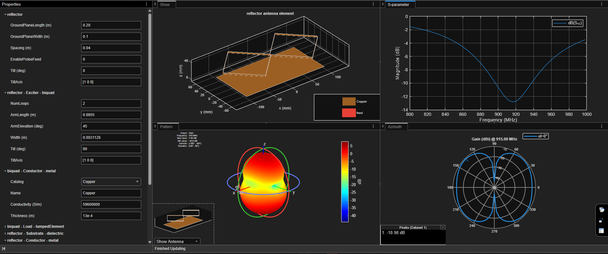
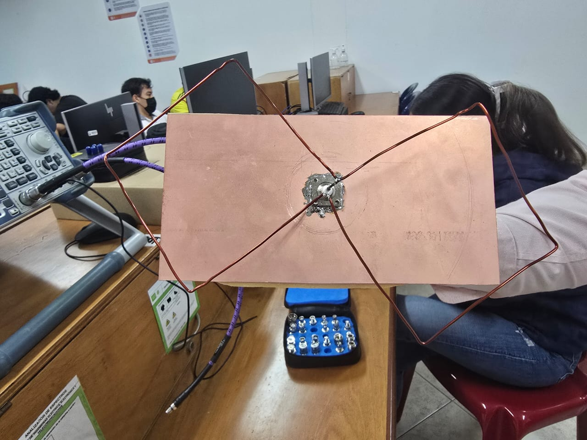
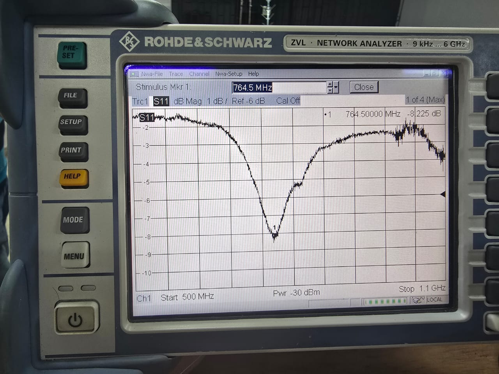
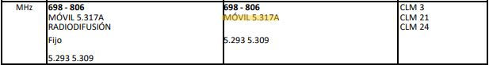
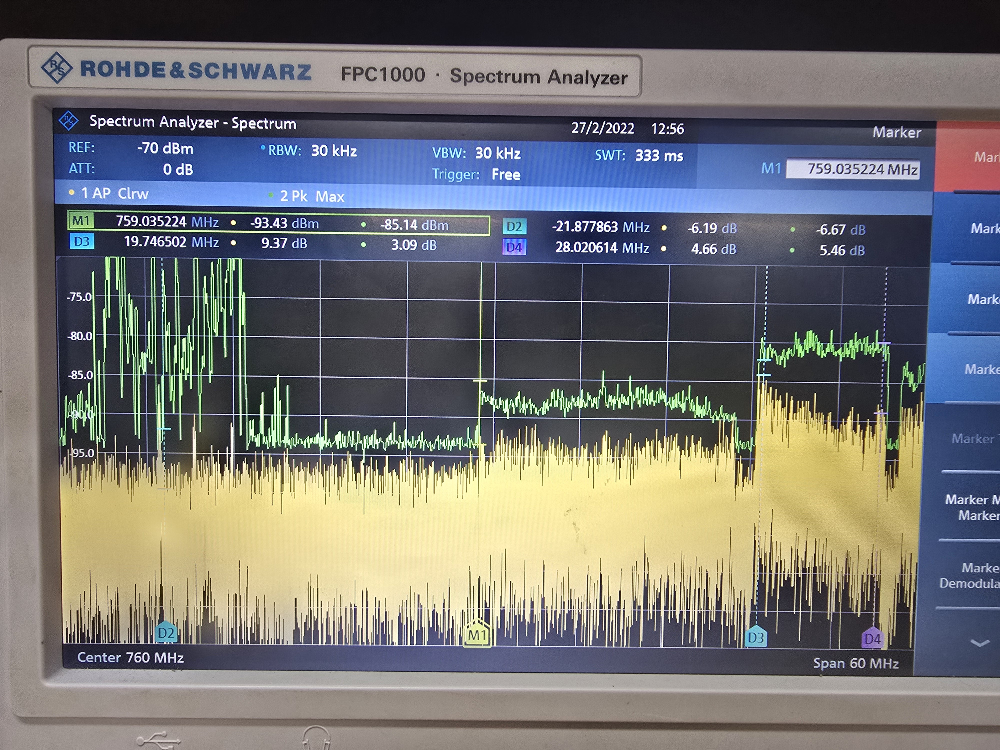
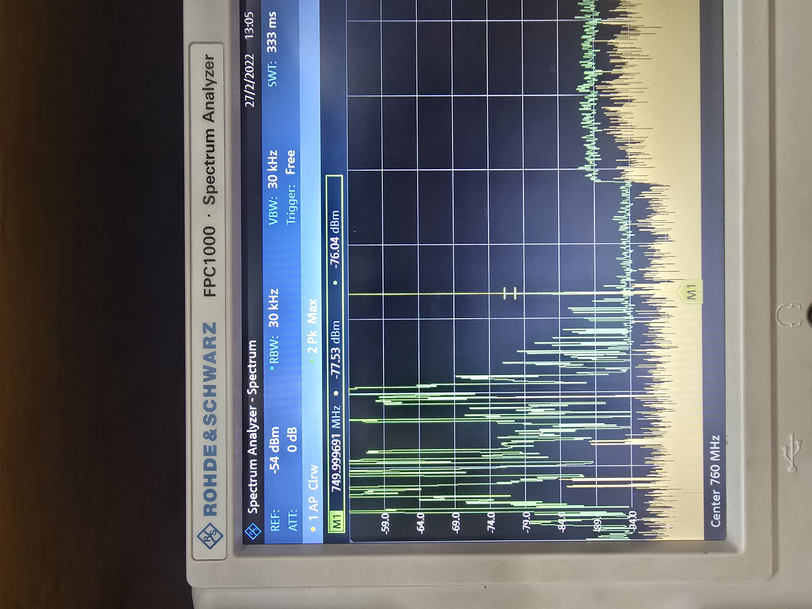
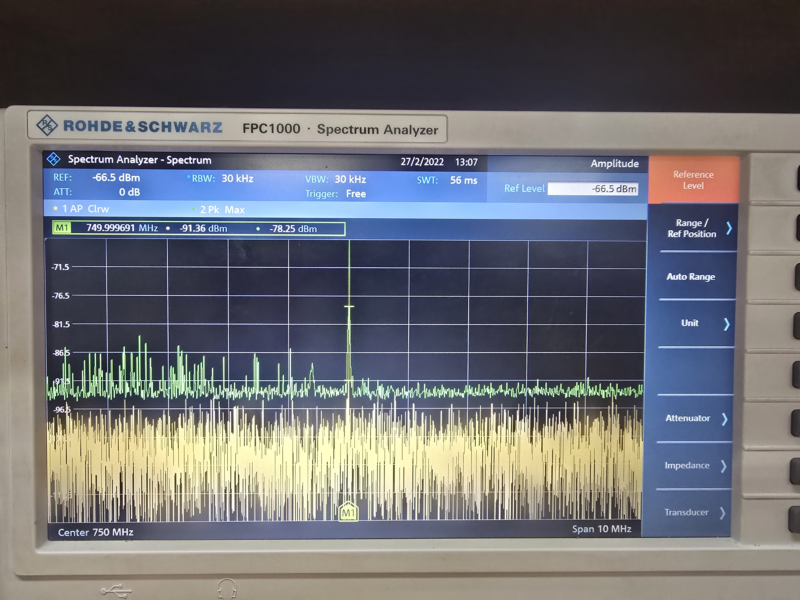

# Laboratorio de Comunicaciones
## Universidad Industrial de Santander

---
# Misión 1: Reconocimiento de Equipos y Espectro

### Integrantes
- **MICHELLE GARZÓN CAMPOS** - 2202785
- **JOHAN SEBASTIAN FANDIÑO** - 2204271

Escuela de Ingenierías Eléctrica, Electrónica y de Telecomunicaciones  
Universidad Industrial de Santander

---

## Declaración de Originalidad y Responsabilidad
Los autores de este informe certifican que el contenido aquí presentado es original y ha sido elaborado de manera independiente. Se han utilizado fuentes externas únicamente como referencia y han sido debidamente citadas.

Asimismo, los autores asumen plena responsabilidad por la información contenida en este documento. 

Uso de IA: Se utilizó ChatGPT para reformular secciones del texto y verificar gramática, pero el contenido técnico fue desarrollado íntegramente por los autores.

---
## Contenido

### Resumen
En esta ocasión tratamos de diseñar, construir y probar una antena llamada Biquad con reflector. El objetivo era que funcionara a una frecuencia de 915 MHz y que fuera direccional para captar mejor las señales. Usamos MATLAB para simular las dimensiones ideales, y luego se sontruyó con alabre de cobre y un reflector. Debido a la falta de precisión, la frecuencia de resonancia no fue la misma a la simulada, sin embargo, se demostró que la antena es totalmente funcional.

**Palabras clave:** SDR, Analizador de Espectro, Osciloscopio, Frecuencia, Tiempo. 

### Introducción
Este informe explica cómo se creó una Antena Biquad con un reflector. El diseño se basa en la idea de que dos cuadrados de alambre (los "quads") captan la señal, y una placa metálica detrás (el reflector) empuja toda esa energía hacia adelante. Esto hace que la antena tenga más potencia en una dirección.
El proceso se dividió en tres partes:
1) Diseño: Calcular y simular las medidas perfectas en la computadora.
2) Construcción: Fabricar la antena con las medidas obtenidas.
3) Medición: Probar la antena con equipos de laboratorio para ver si funcionaba.

### Fase 1: Diseño y Simulación
Para que la antena funcionara a 915 MHz, utilizamos MATLAB para estiamr el tamaño de los cuadrados de alambre y la distancia del reflector.

Ajuste Fino: Usamos el programa MATLAB (Antenna Designer) para simular la antena. Fue como un "prueba y error" digital: primero dejamos que el programa estimara las medidas y luego fuimos modificando el tamaño de los lados y la distancia al reflector hasta que el programa nos dijo que la antena resonaría justo en 915 MHz.

Medidas Ideales (Simuladas):

Lado del cuadrado de alambre: 8.55 cm

Distancia al reflector: 4 cm

Frecuencia esperada: 915 MHz

 

El patrón de radiación simulado confirmó que la antena debería ser direccional (tendría un lóbulo grande hacia adelante).

## Fase 2: Construcción
En esta fase, usamos las medidas de la simulación para construir la antena con alambre de cobre y una placa reflectora.

Detalle Importante: La construcción se hizo de forma rústica y no se tuvo cuidado "milimétrico" con las medidas. Esto, como ya se esperaba, significaría que los resultados en el laboratorio no serían totalmente exactos.

 

## Fase 3: Medición y Validación
Se probó la antena en el laboratorio con dos equipos:

VNA (Vector Network Analyzer): Mide la frecuencia de resonancia.

Analizador de Espectro: Mide la señal recibida y comprueba la directividad.

Resultado 1: Resonancia
Al medir la frecuencia real, se encontró una gran diferencia con respecto a la simulada. La desviación fue de aproximadamente 150 MHz.

 

Resultado 2: Frecuencias operacionales encontradas
En la frecuencia de resonancia y asumiendo un ancho de banda de 60 MHz pudimos encontrar dos bandas de frecuencias que se usan para telefonia fija según el Cuadro Nacional de Atribución de Bandas.

 

Resultado 3: Funcionalidad (Directividad)
- Para esta prueba, el profesor generó una señal de prueba.
- Conectamos la antena al Analizador de Espectro.
- Al apuntar la antena directamente a la fuente de la señal, la señal en la pantalla aumentó mucho.
- Al moverla, la señal bajaba.

Conclusión Funcional: La antena es totalmente funcional y direccional, tal como se había planeado. Logramos visualizar una banda de frecuencia de televisión en el analizador.

También hicimos una comparación con una antena comercial para determinar la ganancia de la antena construida, la antena comercial tenia una ganancia de 6 dBm, y al comparar con la contruida hayamos una diferencia de 2 dBm al medir con la antena costruida, por lo cual concluimos que esta tiene una ganancia de 4 dBm.

 

### Análisis y Conclusiones
¿Por qué falló la frecuencia?
- La principal razón de que la frecuencia real no fuera 915 MHz es la construcción imprecisa. En las antenas, la precision es crucial. Al construirla "rústicamente", las dimensiones no fueron exactas.

¿Por qué funcionó la directividad?
- La directividad sí se cumplió porque el concepto de diseño con el reflector es correcto. Aunque la antena no resonó exactamente donde queríamos, la antena es funcional.

Conclusión Final:

El proyecto fue un éxito en su objetivo principal: se demostró que el diseño de la Antena Biquad con reflector crea un patrón direccional. Sin embargo, se confirma que la precisión en la construcción es el factor más crítico para que la antena funcione exactamente en la frecuencia deseada. El ajuste de dimensiones en el programa de simulación (MATLAB) fue vital para encontrar el punto de partida del diseño.

---

Volver al [INICIO](#laboratorio-de-comunicaciones)
